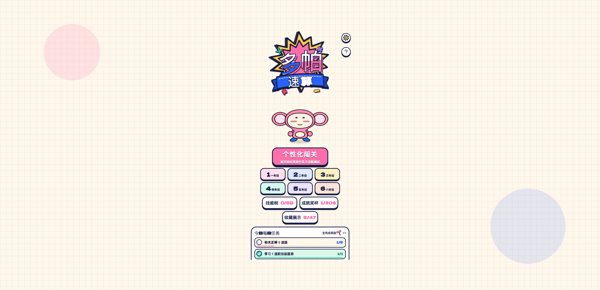
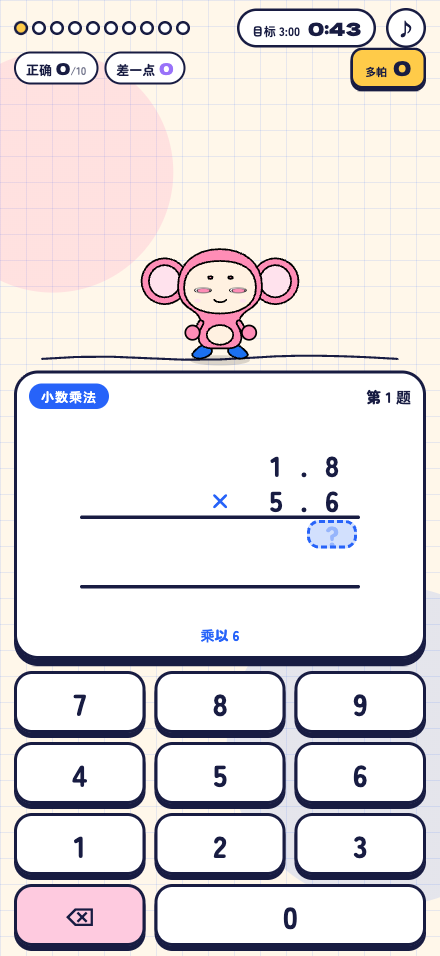
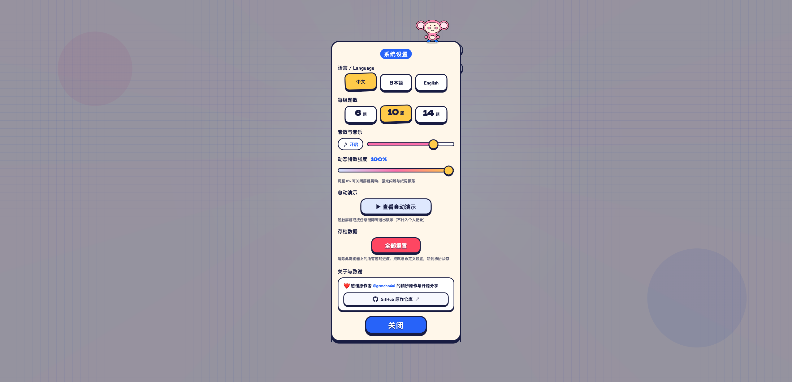
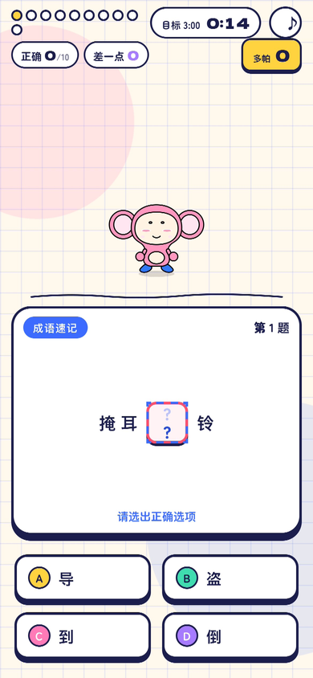
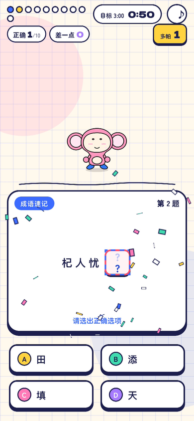

# 多帕速算 (Dopa Drill)

一款会"上头"的网页闯关游戏：每答对一题，舞台灯光亮一层、音乐快一拍、彩带多一把。刷着刷着，屏幕就变成了狂欢现场。

基于 [grmchn/dopa-drill](https://github.com/grmchn/dopa-drill) 做的深度中文汉化与多语言增强，并新增了语文模式。

[](LICENSE)
[]()
[]()
[]()
[]()

---

## 截图

### 数学速算

| 主页大厅 | 竖式答题 | 设置与致谢 |
| :---: | :---: | :---: |
|  |  |  |

### 语文速练

| 双学科切换 | 成语四选一 | 连击庆祝 | 结算页 |
| :---: | :---: | :---: | :---: |
|  |  |  |  |

---

## 这是个什么游戏

纯静态、零依赖，打开就能玩的学科闯关页游。

主角是一只叫多帕吉的小猴子。你输入答案，它跑过来把数字搬进格子里；答对了就鼓掌蹦跳，身后的彩旗、灯光、礼花一层层解锁。答错了没有红叉，也没有 Game Over，它眨眨眼，把提示递到你面前。

---

## 两种模式，顶部一键切换

```
┌─────────────────────────────────────┐
│  🔢 数学速算   │   📖 语文速练      │
└─────────────────────────────────────┘
```

### 数学速算

- 58 个技能，覆盖小学 1~6 年级：加减乘除、竖式、小数、分数、百分比
- 竖式支持逐步填空，进位、退位、余数都能单独作答，错在哪一步一目了然
- 技能按依赖关系组成技能树，逐级解锁
- 第一次玩有实力诊断，测完告诉你接下来练什么

### 语文速练

- 706 道题：240 道手写打底，466 道按数据表自动生成（读音、成语两条线），1~6 年级全覆盖
- 四选一点按，不用打字（原因见下一节）
- 答对后浮出知识点释义，玩着玩着就记住了
- 出题用三级优先牌堆：没见过的优先，本轮没用过的其次，实在没有才洗牌；做过的题跨会话也记着（最多 500 道），706 道刷完才重洗

### 为什么语文模式不用打字

数学只要敲数字，语文打字要切输入法、拼拼音、选字、确认，一套下来连击节奏全断。所以语文模式干脆不让打字，改成四选一点按：

```
┌──────────────┬──────────────┐
│  Ⓐ  待       │  Ⓑ  侍       │
├──────────────┼──────────────┤
│  Ⓒ  代       │  Ⓓ  袋       │
└──────────────┴──────────────┘
```

触屏直接点，键盘按 1/2/3/4 或 A/B/C/D，一题一拍，连击不断。

---

## 其他细节

- 声音：零音频文件。BGM、鼓点、欢呼、金币声全部由 Web Audio API 实时合成，音乐会跟着你的手速加速、变调、叠声部
- 306 个成就奖杯，47 种可解锁装扮（猴子配色、舞台地砖、打击特效、BGM、笔迹……），每日打卡和随机任务
- 数据只存浏览器 localStorage，不上传、不采集、不追踪
- 支持减少动态效果，音量动画可调，键盘全程可操作，关键元素带 ARIA 标注

---

## 技术

刻意做"轻"：无依赖、无音频文件、无后端。

- 原生 ES Modules，无打包，源码即产物
- Canvas + SVG + CSS 混搭做特效，动画走统一帧时钟，可复现可测试
- 字体放本地，不依赖 CDN
- 顺手修了原作几个坑，比如竖式里小数点下沉压穿横线的问题

### 目录结构

```text
dopa-drill/
├── app/                      # 游戏本体，部署的就是这个目录
│   ├── index.html            # 页面骨架与弹窗容器
│   ├── style.css             # 样式系统（响应式 + 多语言 + 语文模式）
│   ├── js/                   # 原生 ES Modules
│   │   ├── main.js           # 总控：状态机、输入、动效编排、学科切换
│   │   ├── chinese_bank.js   # 🆕 语文题库 + 出题牌堆（706 题 / 24 技能）
│   │   ├── chinese_gen.js    # 🆕 语文自动出题：固定种子，确定性组题
│   │   ├── chinese_pinyin_data.js  # 🆕 多音字数据表（110+ 字）
│   │   ├── chinese_idiom_data.js   # 🆕 成语数据表（240 条）+ 同音字池
│   │   ├── problems.js       # 数学题库与解题步骤生成
│   │   ├── skills.js         # 58 个数学技能与依赖图谱
│   │   ├── audio.js          # Web Audio 实时音乐与音效合成
│   │   ├── dopakichi.js      # 吉祥物多帕吉的骨骼与动作驱动
│   │   ├── fx.js             # 粒子、彩带、烟花特效
│   │   ├── bg.js             # 背景与舞台灯光
│   │   ├── i18n.js           # 中 / 日 / 英 三语字典与动态翻译
│   │   ├── trophies.js       # 306 项成就系统
│   │   ├── unlocks.js        # 47 种装扮与特效收集
│   │   ├── quests.js         # 每日任务
│   │   ├── growth.js         # 成长曲线与统计
│   │   ├── session.js        # 关卡规划、技能解锁、错题复习
│   │   ├── scoring.js        # 计分与连击
│   │   ├── store.js          # localStorage 持久化
│   │   ├── core.js           # 帧时钟、补间、缓动、弹簧
│   │   └── guide.js          # 新手引导
│   └── fonts/                # 本地字体文件
├── tests/                    # 单元测试（Node.js 原生 test runner，73 项）
│   ├── app_chinese.test.mjs  # 🆕 语文题库与出题牌堆专项测试
│   └── ...
├── docs/                     # 原作设计文档与课程规范
└── README.md
```

---

## 本地运行

纯静态，不需要编译也不需要装依赖，用任意静态服务器托管 `app/` 目录就行：

```bash
python3 -m http.server 8089 -d app
```

然后打开 <http://localhost:8089/> 就能玩。

注意项目用的是原生 ES Modules，必须走 HTTP，直接双击 `file://` 打开会被浏览器同源策略拦住。

---

## 测试

需要 Node.js 20+：

```bash
node --test tests/*.test.mjs
```

73 项，全过。覆盖出题器、技能图无环校验、计分连击、多语言词条覆盖、语文题库完整性、出题不重复。

---

## 部署

就是个静态文件夹，扔哪都行：

- Cloudflare Pages：构建命令留空，输出目录填 `app`
- Vercel / Netlify：同上
- GitHub Pages：把 `app/` 内容推到 `gh-pages` 分支
- VPS / Nginx：直接丢进网站根目录

注意：如果前面挂了 CDN，改完 JS/CSS 记得加版本号做缓存破坏，不然用户可能拿到"新 HTML + 旧 JS"的错配组合。

---

## 更新日志

### v1.1 —— 语文模式

- 新增语文速练，与数学一键切换
- 706 道题（240 手写 + 466 自动生成），24 个技能节点
- 四选一作答，键盘支持 1234 / ABCD
- 三级优先出题牌堆，单轮不重复；跨会话去重
- 答对展示知识点释义
- 修复：加时赛点击无响应、切后台动画卡死；错别字题干改成 3 种问法轮换

### v1.0 —— 中文汉化增强版

- 全项目多语言重构，中/日/英无刷新切换，默认简体中文
- 数学术语按国内教材本地化
- 动态解题步骤的正则拦截翻译
- 修复竖式小数点基线对齐
- 设置页加入原作者致谢

---

## 致谢

- 原作 [grmchn/dopa-drill](https://github.com/grmchn/dopa-drill)（[@grmchn](https://github.com/grmchn)）：多巴胺视听反馈的整套设计都出自这里
- 中文汉化 [yuanyang749/dopa-drill](https://github.com/yuanyang749/dopa-drill)：深度中文本地化与多语言增强
- 本仓库在汉化版基础上新增了语文双学科模式

---

## 许可

[MIT](LICENSE)
